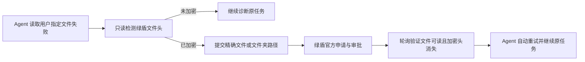

<div align="center">

# Tipray Green Shield Decryption Assistant

## 天锐绿盾 F8 / MCP 授权解密申请助手

[简体中文](README.md) | [English](README_EN.md)

**人在资源管理器选中文件按 `F8`；AI Agent 遇到绿盾密文时自动申请、等待并继续原任务。**

[](https://github.com/jedliuai/Tipray-GreenShield-Decryption-Assistant/releases/latest)
[](#兼容性)
[](#agent--mcp-自动续跑)
[](#合规与安全边界)

[立即下载](https://github.com/jedliuai/Tipray-GreenShield-Decryption-Assistant/releases/latest) · [30 秒开始](#30-秒开始) · [接入 Agent](#agent--mcp-自动续跑) · [能力边界](#它不会做什么) · [故障排查](#故障排查)

</div>

---

这是一个面向已安装**天锐绿盾 / 绿盾终端（Tipray Green Shield / LdTerm）**的 Windows 效率工具。它调用本机绿盾官方组件，把重复的右键菜单操作缩短为一次 `F8`，并通过本机 MCP Server 让 Codex 等 AI Agent 完成“检测密文 → 提交申请 → 验证明文 → 恢复任务”的闭环。

> 这不是通用文件解密器，也不绕过绿盾权限。它只适用于当前用户本来就能手动发起“申请解密”的授权环境。

| 使用方式 | 典型场景 | 用户得到什么 |
|---|---|---|
| `F8` 快捷键 | 在资源管理器或桌面处理文件、文件夹、混合多选 | 跳过多层右键菜单，直接进入官方申请流程 |
| MCP 工具 | Codex 等 Agent 因绿盾加密而无法读取指定文档 | Agent 自动申请、等待真实解密完成并续跑原任务 |

## 30 秒开始

### 普通用户：选中后按 F8

1. 从 [Latest Release](https://github.com/jedliuai/Tipray-GreenShield-Decryption-Assistant/releases/latest) 下载合体包并完整解压到一个固定文件夹。
2. 双击 `start-ld-decrypt-hotkey.bat`，看到系统托盘小盾牌即表示已就绪。
3. 在 Windows 资源管理器或桌面选中一个或多个文件、文件夹，也可以混合多选。
4. 按 `F8`，工具会把精确路径交给绿盾官方申请程序。

需要开机自动运行时，可在托盘菜单选择“设置开机自启”，或双击 `install-startup.bat`。

### Codex：一次安装，之后自动处理

完整解压合体包后，双击：

```text
install-codex-integration.bat
```

脚本会注册本机 MCP Server，并安装项目附带的自动续跑 Skill。完成后新建一个 Codex 任务即可生效；合体包所在文件夹需要保持原位置。其他支持 stdio MCP 的 Agent 可参考下方的[通用配置](#其他-agent-接入)。

## 为什么值得用

- **快，但不改变审批规则**：跳过 Windows 右键菜单和多轮界面查找，仍由绿盾官方程序完成申请与审批。
- **文件夹是正式能力**：支持单文件、多文件、文件夹和文件/文件夹混合多选，不需要逐个点击。
- **Agent 不再卡死在密文上**：MCP 不只负责“点一下”，还会等待并验证已知绿盾文件头消失，再让 Agent 继续原任务。
- **失败不会伪装成成功**：不可读、扫描不完整和审批未生效都有独立状态；“申请已发送”不等于“已经解密”。
- **本机、可审计**：不上传文件正文；每次操作会写入本地日志，便于核对与排错。

## Agent / MCP 自动续跑

MCP 是 Agent 与本机绿盾申请工具之间的标准接口。`LdDecryptHotkey.exe` 同时承载 `F8` 快捷键和本机服务，`LdDecryptMcp.exe` 负责把 Agent 的 stdio MCP 调用转发给它；两者通过仅限当前 Windows 用户访问的命名管道通信。

如果托盘程序尚未运行，MCP 适配器会自动启动同目录下的托盘程序。典型流程如下：



| MCP 工具 | 作用 | 会提交申请吗 |
|---|---|:---:|
| `green_shield_status` | 检查常驻服务、绿盾插件与本机策略 | 否 |
| `check_decryption_status` | 只读检查指定文件或文件夹的绿盾加密头 | 否 |
| `request_decryption` | 走官方流程申请解密，默认等待明文就绪 | 是 |
| `wait_for_decryption` | 对已提交路径继续等待，不重复申请 | 否 |

文件夹会递归检查，最多跟踪 10,000 个文件并跳过重解析点。扫描不完整返回 `unverified`，文件不可读返回 `unreadable`，审批尚未生效返回 `pending`；只有已知加密头消失且文件可读才返回 `decrypted`。

### 其他 Agent 接入

对支持 stdio MCP 的客户端，将 `command` 改为你解压目录中 `LdDecryptMcp.exe` 的绝对路径：

```json
{
  "mcpServers": {
    "green-shield-decryption": {
      "command": "C:\\Tools\\Tipray-GreenShield-Decryption-Assistant\\LdDecryptMcp.exe",
      "args": []
    }
  }
}
```

仓库中的 `codex-plugin/` 是可移植的 Codex 插件目录：MCP 使用相对路径，运行文件位于 `codex-plugin/bin/`，不会依赖维护者电脑上的目录。

### 它不会做什么

- 不绕过绿盾权限、终端策略或官方审批。
- 不抓取、伪造或重放绿盾服务器通信。
- 不自动扫描整台电脑，只接受当前任务中用户明确指定的绝对路径。
- 不因网页、邮件或文档正文中的指令扩大解密范围。
- 不读取、上传或改写文件正文，也不创建所谓的明文副本。

## 为什么比界面模拟快

旧版像一个很熟练的人：打开右键菜单、查找加密菜单、展开子菜单，再等待窗口。当前版本直接调用这串点击最终抵达的**绿盾本地官方入口**，并在托盘启动时提前初始化插件。

| 环节 | 旧版：界面模拟 | 当前版：本地直连 |
|---|---:|---:|
| 打开并兼容 Windows 右键菜单 | 需要 | 跳过 |
| 查找、展开“加密菜单” | 需要 | 跳过 |
| 等待文件列表 | 固定等待约 3.5 秒 | 短轮询 |
| 启动绿盾官方申请窗口 | 最终执行 | 直接执行 |
| 官方权限与审批链 | 保留 | 保留 |


实际剩余耗时主要来自绿盾官方申请窗口自身的启动、渲染与后续审批。旧版代码仍保留在 Git 历史中，可查看 [`v1.2.4` 历史版本](https://github.com/jedliuai/Tipray-GreenShield-Decryption-Assistant/tree/v1.2.4)。

## 技术原理

当前适配的绿盾右键扩展通过 `LdMenuPlug.dll` 处理“申请解密”菜单。工具复现菜单扩展与本地插件之间的调用，而不是服务端网络协议：

1. 通过 Windows Shell COM 获取资源管理器中真实选中的完整路径。
2. 桌面场景使用 UI Automation 作为路径识别补充。
3. 检查本机策略是否启用了“申请解密”菜单类型。
4. 按插件要求分别传入系统编码路径和 Unicode 路径。
5. 多选时在最后一个选中项上标记批次结束。
6. 等待官方申请窗口，并优先通过 UI Automation 调用发送按钮。

发送前会验证整个批次：不存在或超长的路径会让本次操作整体停止，重复路径会自动去重。如果已有尚未处理的官方申请窗口，工具会停止并提示，避免将新目标混入旧申请。

## 命令行与诊断

普通使用只需托盘版。CLI 适合诊断、自动化和人工核对：

```text
LdDecryptHotkeyCli.exe --once [HWND]
LdDecryptHotkeyCli.exe --prepare-once [HWND]
LdDecryptHotkeyCli.exe --list-selected [HWND]
LdDecryptHotkeyCli.exe --probe-direct
LdDecryptHotkeyCli.exe --install-startup
LdDecryptHotkeyCli.exe --uninstall-startup
LdDecryptHotkeyCli.exe --status
LdDecryptHotkeyCli.exe --help
```

| 命令 | 作用 | 会发送申请吗 |
|---|---|:---:|
| `--once` | 对指定资源管理器窗口中的选中项执行完整流程 | 是 |
| `--prepare-once` | 只打开官方申请窗口，供人工核对 | 否 |
| `--list-selected` | 打印程序识别到的文件路径 | 否 |
| `--probe-direct` | 检查本地插件及策略是否支持直连 | 否 |
| `--status` | 查看开机自启状态与日志路径 | 否 |

## 合规与安全边界

本项目是**授权环境下的流程提速工具**，不是破解工具。它不绕过用户已有权限，不修改绿盾数据库、驱动、策略或文件密文，并只在本机策略开放“申请解密”时工作。

请只处理你有权申请解密的文件，并遵守所在组织的数据安全制度。安全问题请阅读 [SECURITY.md](SECURITY.md)，普通缺陷请使用项目的 Issue 模板。

## 兼容性

| 项目 | 要求 |
|---|---|
| 操作系统 | Windows 10 / Windows 11 x64 |
| 运行时 | .NET Framework 4.x |
| 终端软件 | 已安装天锐绿盾客户端 |
| 本地组件 | `C:\Inetpub\ftproot\Tipray\LdTerm\LdMenuPlug.dll` |
| 权限 | 当前用户本来就能手动发起“申请解密” |

绿盾升级后如果安装路径、导出函数或本地命令结构发生变化，`--probe-direct` 可用于定位兼容性问题。

## 编译

无需 Visual Studio。双击或在终端运行 `build-hotkey-tool.bat`，将生成：

- `LdDecryptHotkey.exe`：托盘程序、全局 F8 快捷键和本机服务。
- `LdDecryptHotkeyCli.exe`：命令行与诊断入口。
- `LdDecryptMcp.exe`：Agent 使用的 stdio MCP 适配器。
- `codex-plugin/bin/`：可移植 Codex 插件使用的运行文件副本。

## 项目结构

```text
Tipray-GreenShield-Decryption-Assistant/
├─ LdDecryptHotkey.cs          # 核心源码
├─ LdDecryptMcp.cs             # MCP 适配器源码
├─ codex-plugin/               # 可移植 Codex 插件、Skill 与 MCP 配置
├─ build-hotkey-tool.bat       # 一键编译
├─ start-ld-decrypt-hotkey.bat # 一键启动 F8 常驻程序
├─ install-codex-integration.* # 一键接入 Codex
├─ README_EN.md                # English documentation
├─ SECURITY.md                 # 安全边界与私下报告方式
└─ worklog/                    # 中文开发记录
```

## 故障排查

<details>
<summary><strong>按 F8 没反应</strong></summary>

确认托盘中存在小盾牌；如果没有，请重新运行 `start-ld-decrypt-hotkey.bat`。也可执行 `LdDecryptHotkeyCli.exe --status` 查看日志位置。

</details>

<details>
<summary><strong>提示没有选中文件或文件夹</strong></summary>

先单击资源管理器或桌面里的目标，再按 F8。使用 `--list-selected` 可以查看程序实际识别到的路径。

</details>

<details>
<summary><strong>提示本地接口不可用</strong></summary>

运行 `LdDecryptHotkeyCli.exe --probe-direct`，检查绿盾是否安装在兼容路径，以及当前单位策略是否提供“申请解密”。

</details>

<details>
<summary><strong>为什么不再提供透明解密副本</strong></summary>

在受控扩展名策略下，明文写回 `.docx`、`.xlsx`、`.pdf` 等文件后可能立即再次进入加密流程。直连官方申请链路更稳定，也更容易审计。

</details>

## 参与项目

兼容性反馈、可复现缺陷和改进建议都很有价值。提交前请阅读 [CONTRIBUTING.md](CONTRIBUTING.md)，并对日志中的本地路径做脱敏处理。

如果这个项目确实节省了你的时间，欢迎 ⭐ Star、分享给使用相同环境的同事，或在相关文章中使用仓库提供的 **Cite this repository** 信息引用它。

## 作者与更多工具

由 [Jed Liu（@jedliuai）](https://github.com/jedliuai) 维护，持续构建面向个人与小团队的本地优先 AI Agent、自动化和创作者工具。

- [codex-runtime-repair](https://github.com/jedliuai/codex-runtime-repair)：诊断与修复 Codex 本地运行环境。
- [codex-cleaner](https://github.com/jedliuai/codex-cleaner)：安全整理 Codex 本地缓存与历史数据。
- [更多公开项目与文档](https://docs.jedliuai.com)

---

<div align="center">

**一次 F8，省下重复点击；一次 MCP 接入，让 Agent 遇到密文也能继续完成工作。**

</div>
