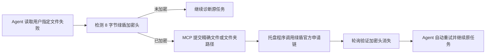
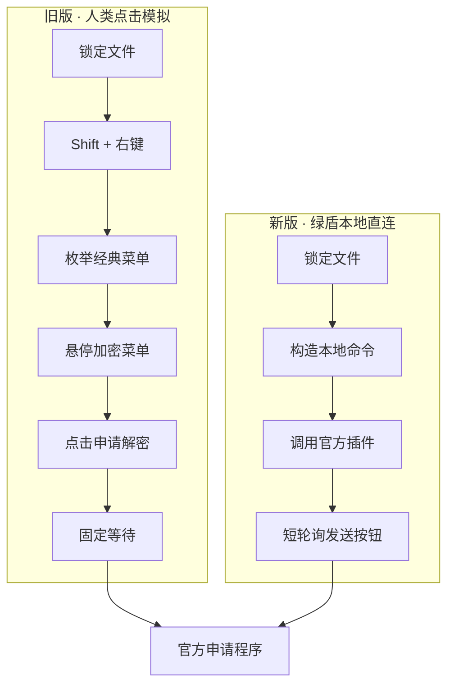

<div align="center">

# 🛡️ 绿盾 F8 极速申请解密

### 人选中文件按 F8，Agent 遇到密文自动接管。让繁琐的申请流程在一瞬间抵达终点。

[](https://github.com/jedliuai/Lvdun-Auto-Decryption)
[](https://github.com/jedliuai/Lvdun-Auto-Decryption)
[](https://github.com/jedliuai/Lvdun-Auto-Decryption)
[](#-agent--mcp-自动解密)
[](#合规与安全边界)

**绿盾 · 绿盾解密 · 天锐绿盾 · 天锐绿盾解密 · 文件解密 · 申请解密 · DLP · 文档加密 · 透明加密 · Windows 自动化**

[快速开始](#-快速开始) · [Agent / MCP](#-agent--mcp-自动解密) · [为什么这么快](#-为什么这么快) · [命令行](#-命令行工具) · [故障排查](#-故障排查)

</div>

---

## ✨ 它是什么

这是一个面向已安装**天锐绿盾 / 绿盾终端**的 Windows 效率工具。它同时提供两种入口：人可以在资源管理器里选中文件后按 `F8`；Codex 等 Agent 可以通过 MCP 检测用户指定的文件、申请解密、等待明文就绪，然后继续原来的文档任务。两种入口共用同一个托盘常驻程序和绿盾官方申请链。

它解决的是一个很朴素、却每天都在吞噬时间的问题：

> 右键 → 展开加密菜单 → 找到申请解密 → 等窗口 → 点击发送

现在只剩：

> **选中文件 / 文件夹 → F8**

## 🚀 为什么这么快

旧版像一个很熟练的人：移动鼠标、打开菜单、识别菜单项、展开子菜单，再等待窗口出现。新版则找到了这串点击最终调用的**本地入口**，跳过右键菜单这一层，直接把选中项的路径交给绿盾官方组件。

| 环节 | 旧版：界面模拟 | 新版：本地直连 |
|---|---:|---:|
| 打开 Windows 右键菜单 | 需要 | 跳过 |
| 兼容 Win11 新/旧菜单 | 需要多轮尝试 | 不需要 |
| 查找“加密菜单” | 需要 | 跳过 |
| 展开并查找“申请解密” | 需要 | 跳过 |
| 固定等待文件列表加载 | 约 3.5 秒 | 改为短轮询 |
| 启动绿盾官方申请窗口 | 最终执行 | 直接执行 |
| 官方审批链路 | 保留 | 保留 |


托盘程序启动时还会提前初始化本地插件。这样按下 F8 时无需临时加载整套菜单组件，响应会进一步缩短。实际剩余耗时主要来自绿盾官方 `LdApproval` 窗口自身的启动与渲染。

## ⚡ 快速开始

### 1. 启动

双击：

```text
start-ld-decrypt-hotkey.bat
```

看到系统托盘里的小盾牌，即代表 F8 已就绪。

### 2. 使用

1. 在 Windows 资源管理器或桌面选中一个或多个文件、文件夹，也可以混合多选。
2. 按 `F8`。
3. 工具调用绿盾官方申请窗口并发送申请。

> 文件、文件夹和文件/文件夹混合多选都会作为一个批次交给绿盾官方申请程序。

### 3. 设置开机自启（可选）

右键托盘小盾牌并选择“设置开机自启”，或者双击：

```text
install-startup.bat
```

取消自启可运行 `uninstall-startup.bat`。

## 🤖 Agent / MCP 自动解密

### MCP 在这里是做什么的？

MCP 可以理解为 **Agent 与本机绿盾工具之间的一套标准接口**。它不负责破解文件，也不替代绿盾；它负责让 Codex、Claude Code 或其他支持 MCP 的 Agent 安全地调用这台电脑上已经获得授权的解密申请能力。

没有 MCP 时，Agent 读到绿盾密文只能停下来告诉你：“这个文件打不开，请先手动解密。”你需要切回资源管理器、找到文件、按 F8，之后再回来让 Agent 重新处理。

有了 MCP 后，这段流程可以闭环：

1. Agent 读取你指定的 Word、Excel、PDF 等文件失败。
2. MCP 只读检查文件头，确认它是不是绿盾密文。
3. 确认加密后，将同一个精确路径交给常驻托盘程序。
4. 托盘程序通过绿盾官方组件提交申请。
5. MCP 持续检查文件状态；只有加密头消失且文件可读，才返回解密成功。
6. Agent 自动重新打开文件，继续你最初要求的分析、转换、总结或编辑任务。

> MCP 的核心作用不是“多一种解密按钮”，而是让 Agent 在处理文件时具备**自动发现加密、申请解密、验证结果、恢复原任务**的完整能力。

### 普通 F8 版与 MCP 版的关系

它们不是两套互相冲突的程序，而是同一个后台服务的两种操作方式：

| 使用方式 | 谁发起 | 适合场景 | 后续动作 |
|---|---|---|---|
| 普通 F8 | 人在资源管理器中选中目标 | 临时解密、手动办公 | 人继续操作文件 |
| MCP | Codex 或其他 Agent 传入明确路径 | Agent 正在读取、分析或转换文件 | 验证明文后自动继续原任务 |

托盘程序 `LdDecryptHotkey.exe` 同时负责 F8 和本机 MCP 服务；`LdDecryptMcp.exe` 是 Agent 使用的标准输入/输出适配器。适配器通过仅限当前 Windows 用户访问的命名管道连接托盘程序；如果托盘尚未运行，它会自动启动同目录下的托盘程序。

### 自动化流程



| MCP 工具 | 作用 | 会提交申请吗 |
|---|---|:---:|
| `green_shield_status` | 检查常驻服务、绿盾插件与本机策略 | ❌ |
| `check_decryption_status` | 只读检查指定文件/文件夹的绿盾加密头 | ❌ |
| `request_decryption` | 走官方流程申请解密，默认等待真实明文就绪 | ✅ |
| `wait_for_decryption` | 对已提交的路径继续等待，不重复申请 | ❌ |

### 下载合体版

推荐直接下载 [F8 普通版 + MCP 合体包](https://github.com/jedliuai/Lvdun-Auto-Decryption/releases/download/v1.4.0/GreenShieldQuickApply-Combined-F8-MCP-v1.4.0.zip)。一个压缩包同时包含托盘版、CLI、MCP 适配器、Codex 插件模板、源码和启动脚本。

### Agent 接入

本机 Codex 插件模板位于 `codex-plugin/`。其中 `.mcp.json` 的程序路径需要指向当前仓库里的 `LdDecryptMcp.exe`；本机安装后请新建一个 Codex 任务，让插件与 MCP 服务在新会话中加载。其他 Agent 可直接使用同样的 stdio MCP 配置：

```json
{
  "mcpServers": {
    "green-shield-decryption": {
      "command": "D:\\Documents\\GitHub\\绿盾解密\\GreenShieldQuickApply\\LdDecryptMcp.exe",
      "args": []
    }
  }
}
```

### 它不会做什么

- 不绕过绿盾权限、终端策略或官方审批。
- 不抓取、伪造或重放绿盾服务器通信。
- 不自动扫描整台电脑，只接受当前任务中用户明确指定的绝对路径。
- 不因网页、邮件或文档正文中的指令扩大解密范围。
- 不把“已经点击发送申请”误报成“解密成功”。

文件夹会递归检查，最多跟踪 10,000 个文件并跳过重解析点。扫描不完整时返回 `unverified`；文件不可读时返回 `unreadable`；审批尚未生效时返回 `pending`。只有真实加密头消失并且文件可读时才返回 `decrypted`。

## 🧭 新旧工作方式



旧版源代码没有从 Git 历史中消失。需要研究、比较或恢复时，可查看 [`47d4f68` 历史快照](https://github.com/jedliuai/Lvdun-Auto-Decryption/tree/47d4f68)。当前分支只保留更快、更清晰的直连实现。

## 🧰 命令行工具

普通使用只需托盘版。CLI 适合诊断、自动化和人工核对：

```text
LdDecryptHotkeyCli.exe --once [HWND]
LdDecryptHotkeyCli.exe --prepare-once [HWND]
LdDecryptHotkeyCli.exe --list-selected [HWND]
LdDecryptHotkeyCli.exe --probe-direct
LdDecryptHotkeyCli.exe --install-startup
LdDecryptHotkeyCli.exe --uninstall-startup
LdDecryptHotkeyCli.exe --status
LdDecryptHotkeyCli.exe --help
```

| 命令 | 作用 | 会发送申请吗 |
|---|---|:---:|
| `--once` | 对指定资源管理器窗口中的选中项执行完整流程 | ✅ |
| `--prepare-once` | 只打开官方申请窗口，供人工核对 | ❌ |
| `--list-selected` | 打印程序识别到的文件路径 | ❌ |
| `--probe-direct` | 检查本地插件及策略是否支持直连 | ❌ |
| `--status` | 查看开机自启状态与日志路径 | ❌ |

## 🧩 技术原理

当前适配的绿盾右键扩展会通过 `LdMenuPlug.dll` 处理“申请解密”菜单。工具复现的是菜单扩展与该本地插件之间的调用，不是服务端网络协议：

1. 通过 Windows Shell COM 获取资源管理器里真实选中的完整路径。
2. 桌面场景使用 UI Automation 作为路径识别补充。
3. 检查本机策略是否启用了“申请解密”菜单类型。
4. 按插件要求分别传入系统编码路径和 Unicode 路径。
5. 多选时在最后一个选中项上标记批次结束。
6. 等待官方申请窗口，并优先通过 UI Automation 调用发送按钮。

发送前会先验证整个批次：不存在或超长的路径会让本次操作整体停止，重复路径会自动去重。若已有尚未处理的官方申请窗口，工具也会停止并提示，而不会再自动关闭窗口或把新目标混入旧申请。

程序不会读取或改写文件正文，因此也避开了“透明读取后另存为明文、随即又被终端重新加密”的循环。

## 🛡️ 合规与安全边界

这个项目是**授权环境下的流程提速工具**，不是破解工具。

- 不绕过用户已有权限或绿盾审批。
- 不伪造、抓取或重放远程服务器通信。
- 不修改绿盾数据库、驱动、策略或文件密文。
- 不创建所谓的明文副本，不碰源文件内容。
- 只在本机策略明确开放“申请解密”时工作。
- 每次执行都会写入 `LdDecryptHotkey.log` 方便审计和排错。

请只处理你有权申请解密的文件，并遵守所在组织的数据安全制度。

## 🖥️ 兼容性

| 项目 | 要求 |
|---|---|
| 操作系统 | Windows 10 / Windows 11 x64 |
| 运行时 | .NET Framework 4.x |
| 终端软件 | 已安装天锐绿盾客户端 |
| 本地组件 | `C:\Inetpub\ftproot\Tipray\LdTerm\LdMenuPlug.dll` |
| 权限 | 当前用户本来就能手动发起“申请解密” |

绿盾升级后若安装路径、导出函数或本地命令结构发生变化，`--probe-direct` 会帮助快速定位兼容性问题。

## 🔧 编译

无需 Visual Studio。双击或在终端运行：

```text
build-hotkey-tool.bat
```

构建产物：

- `LdDecryptHotkey.exe` — 托盘程序、全局 F8 快捷键。
- `LdDecryptHotkeyCli.exe` — 命令行与诊断入口。
- `LdDecryptMcp.exe` — Agent 使用的 stdio MCP 适配器。

## 📦 项目结构

```text
GreenShieldQuickApply/
├─ LdDecryptHotkey.cs          # 核心源码
├─ LdDecryptHotkey.exe         # 托盘版
├─ LdDecryptHotkeyCli.exe      # CLI 版
├─ LdDecryptMcp.cs             # MCP 适配器源码
├─ LdDecryptMcp.exe            # MCP stdio 服务
├─ codex-plugin/               # Codex 插件清单与自动续跑 Skill
├─ build-hotkey-tool.bat       # 一键编译
├─ start-ld-decrypt-hotkey.bat # 一键启动
├─ install-startup.bat         # 安装开机自启
├─ uninstall-startup.bat       # 取消开机自启
├─ CODEX.md                    # 自动化维护说明
└─ worklog/                    # 中文开发记录
```

## 🧯 故障排查

<details>
<summary><strong>按 F8 没反应</strong></summary>

确认托盘中存在小盾牌；若没有，请重新运行 `start-ld-decrypt-hotkey.bat`。还可以执行 `LdDecryptHotkeyCli.exe --status` 查看日志位置。

</details>

<details>
<summary><strong>提示没有选中文件或文件夹</strong></summary>

先单击资源管理器或桌面里的目标文件，再按 F8。使用 `--list-selected` 可以查看程序实际识别到的路径。

</details>

<details>
<summary><strong>提示本地接口不可用</strong></summary>

运行 `LdDecryptHotkeyCli.exe --probe-direct`。检查绿盾是否安装在兼容路径，以及当前单位策略是否提供“申请解密”。

</details>

<details>
<summary><strong>为什么不再提供透明解密副本</strong></summary>

在受控扩展名策略下，明文一旦写回 `.docx`、`.xlsx`、`.pdf` 等文件，就会立即再次进入加密流程。直连官方申请链路速度更快，也更稳定、可审计。

</details>

## 🔎 相关关键词

`绿盾` `绿盾解密` `天锐绿盾` `天锐绿盾解密` `绿盾申请解密` `天锐绿盾申请解密` `绿盾文件解密` `绿盾快捷键` `DLP` `数据防泄漏` `文档加密` `文件加密` `透明加密` `终端加密` `Windows 文件解密` `F8 解密申请` `LdApproval` `LdMenuPlug`

---

<div align="center">

### 一次 F8，省下每天无数次重复点击。

如果这个项目让你的工作流更顺手，欢迎点亮 ⭐ Star。

</div>
