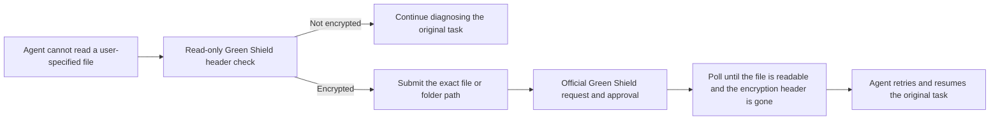
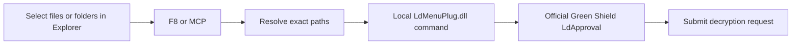

<div align="center">

# Tipray Green Shield Decryption Assistant

## F8 hotkey and local MCP server for authorized decryption requests

[简体中文](README.md) | [English](README_EN.md)

**Select files in Windows Explorer and press `F8`—or let an AI agent request decryption, verify the result, and resume its task automatically.**

[](https://github.com/jedliuai/Tipray-GreenShield-Decryption-Assistant/releases/latest)
[](#compatibility)
[](#agent--mcp-workflow)
[](#security-and-authorization-boundary)

[Download](https://github.com/jedliuai/Tipray-GreenShield-Decryption-Assistant/releases/latest) · [30-second setup](#30-second-setup) · [Agent integration](#agent--mcp-workflow) · [Limitations](#what-it-does-not-do) · [Troubleshooting](#troubleshooting)

</div>

---

Tipray Green Shield Decryption Assistant is a Windows productivity tool for organizations using **Tipray Green Shield / LdTerm** document encryption and DLP software. It calls the locally installed, official Green Shield component to replace a multi-step context-menu operation with one `F8` press. Its local MCP server also enables Codex and other AI agents to complete the full loop: detect an encrypted file, submit an authorized request, verify that readable content is available, and resume the original task.

> This is not a universal file decryptor and does not bypass Green Shield permissions, policies, or approval. It is only useful when the current Windows user is already authorized to submit a decryption request manually.

| Entry point | Typical use case | Outcome |
|---|---|---|
| `F8` hotkey | A person selects files, folders, or a mixed selection in Explorer or on the desktop | Skips nested context menus and opens the official request workflow directly |
| MCP tools | An AI agent cannot read a user-specified document because it is Green Shield encrypted | Requests approval, waits for actual decryption, verifies the file, and resumes the task |

## 30-second setup

### For people: select and press F8

1. Download the combined package from the [latest release](https://github.com/jedliuai/Tipray-GreenShield-Decryption-Assistant/releases/latest), then extract the complete archive to a permanent folder.
2. Double-click `start-ld-decrypt-hotkey.bat`. A shield icon in the system tray means the hotkey is ready.
3. Select one or more files, folders, or a mixed selection in Windows Explorer or on the desktop.
4. Press `F8`. The assistant passes the exact selected paths to the official Green Shield request application.

To start the tray application automatically after sign-in, choose **Enable startup** from its tray menu or run `install-startup.bat`.

### For Codex: install once, then resume automatically

After extracting the complete package, double-click:

```text
install-codex-integration.bat
```

The installer registers the local MCP server and installs the included task-resumption skill. Start a new Codex task after installation so the integration can load. Keep the extracted folder in the same location because the registered MCP command points to its executable.

For other clients that support stdio MCP, see [Integrating other agents](#integrating-other-agents).

## Why this project is useful

- **Fast without changing authorization rules.** It skips Windows context-menu automation while keeping the official Tipray application and approval chain.
- **Folders are a first-class feature.** Single files, multiple files, folders, and mixed file/folder selections are supported.
- **Agents no longer stop at encrypted documents.** MCP waits for a verifiable result instead of merely clicking a request button.
- **Failure is not reported as success.** Unreadable files, incomplete scans, and pending approvals have distinct states.
- **Local and auditable.** File contents are not uploaded. Operations are recorded in a local log for troubleshooting and review.

## Agent / MCP workflow

MCP provides a standard interface between an AI agent and the local Green Shield request assistant. `LdDecryptHotkey.exe` hosts both the `F8` hotkey and the local service. `LdDecryptMcp.exe` exposes stdio MCP and forwards requests through a named pipe that is restricted to the current Windows user.

If the tray application is not running, the MCP adapter starts the copy located beside it.



| MCP tool | Purpose | Submits a request? |
|---|---|:---:|
| `green_shield_status` | Checks the tray service, local plugin, and endpoint policy | No |
| `check_decryption_status` | Performs a read-only encryption-header check on files or folders | No |
| `request_decryption` | Uses the official workflow and, by default, waits for readable content | Yes |
| `wait_for_decryption` | Continues waiting for paths already submitted without sending another request | No |

Folder checks are recursive, stop after 10,000 tracked files, and skip reparse points. An incomplete scan returns `unverified`; an inaccessible file returns `unreadable`; an approval that has not taken effect returns `pending`. The service only returns `decrypted` when the known Green Shield header is gone and the file is readable.

### Integrating other agents

For any client that supports stdio MCP, set `command` to the absolute path of `LdDecryptMcp.exe` in the extracted package:

```json
{
  "mcpServers": {
    "green-shield-decryption": {
      "command": "C:\\Tools\\Tipray-GreenShield-Decryption-Assistant\\LdDecryptMcp.exe",
      "args": []
    }
  }
}
```

The repository also contains a portable Codex plugin under `codex-plugin/`. Its MCP configuration uses relative paths, and the required runtime files are included under `codex-plugin/bin/`; it does not depend on a path from the maintainer's computer.

### What it does not do

- It does not bypass Green Shield permissions, endpoint policies, or approval.
- It does not capture, forge, or replay Green Shield server traffic.
- It does not scan the entire computer; agent tools only accept absolute paths explicitly specified in the current user task.
- It does not expand its scope because a webpage, email, document body, or other untrusted content asks it to decrypt something else.
- It does not read, upload, or rewrite document contents, and it does not create an unofficial plaintext copy.

## Why it is faster than UI automation

The previous implementation behaved like a fast human: open the context menu, locate the encryption submenu, expand it, select the request action, and wait for the window. The current implementation invokes the **official local Green Shield entry point** reached by those clicks and preloads the plugin when the tray application starts.

| Step | Previous UI automation | Current local integration |
|---|---:|---:|
| Open and handle Windows context menus | Required | Skipped |
| Locate and expand the encryption submenu | Required | Skipped |
| Wait for the request file list | Fixed delay of about 3.5 seconds | Short polling |
| Start the official request window | Eventually | Directly |
| Preserve official permissions and approval | Yes | Yes |



The remaining latency mainly comes from the official request application's startup, rendering, and approval process. The older implementation remains available in the [`v1.2.4` release history](https://github.com/jedliuai/Tipray-GreenShield-Decryption-Assistant/tree/v1.2.4).

## How it works

The supported Green Shield shell extension delegates its **Request Decryption** action to `LdMenuPlug.dll`. This project reproduces the local call between the shell extension and that official plugin—it does not reproduce a remote server protocol.

1. Windows Shell COM resolves the exact full paths selected in Explorer.
2. UI Automation provides a fallback for desktop selections.
3. The assistant confirms that local policy exposes the Request Decryption menu type.
4. Paths are passed in both the system encoding and Unicode format expected by the plugin.
5. For multiple selections, the last item is marked as the end of the batch.
6. The assistant waits for the official request window and invokes its submit button through UI Automation when available.

The complete batch is validated before submission. Missing or overlong paths stop the operation, duplicate paths are removed, and an existing unresolved request window prevents a new batch from being mixed into the old one.

## CLI and diagnostics

Most users only need the tray application. The CLI is intended for diagnostics, automation, and manual verification:

```text
LdDecryptHotkeyCli.exe --once [HWND]
LdDecryptHotkeyCli.exe --prepare-once [HWND]
LdDecryptHotkeyCli.exe --list-selected [HWND]
LdDecryptHotkeyCli.exe --probe-direct
LdDecryptHotkeyCli.exe --install-startup
LdDecryptHotkeyCli.exe --uninstall-startup
LdDecryptHotkeyCli.exe --status
LdDecryptHotkeyCli.exe --help
```

| Command | Purpose | Submits a request? |
|---|---|:---:|
| `--once` | Runs the complete workflow for the selected items in a specific Explorer window | Yes |
| `--prepare-once` | Opens the official request window for manual review without submitting | No |
| `--list-selected` | Prints the paths recognized by the assistant | No |
| `--probe-direct` | Checks local plugin and policy compatibility | No |
| `--status` | Shows startup status and the log path | No |

## Security and authorization boundary

This project accelerates an **authorized workflow**; it is not a security-product bypass. It does not change Green Shield drivers, databases, policy, or encrypted file contents, and it only works when local policy already exposes the Request Decryption action to the current user.

Only use it for files you are authorized to request and follow your organization's data-handling rules. See [SECURITY.md](SECURITY.md) for the security boundary and private vulnerability-reporting process.

## Compatibility

| Component | Requirement |
|---|---|
| Operating system | Windows 10 or Windows 11 x64 |
| Runtime | .NET Framework 4.x |
| Endpoint software | Tipray Green Shield client installed |
| Local component | `C:\Inetpub\ftproot\Tipray\LdTerm\LdMenuPlug.dll` |
| Permission | The current user can already submit Request Decryption manually |

If a Green Shield update changes the installation path, exports, or local command structure, run `LdDecryptHotkeyCli.exe --probe-direct` to diagnose compatibility.

## Building from source

Visual Studio is not required. Run `build-hotkey-tool.bat` to produce:

- `LdDecryptHotkey.exe` — tray application, global F8 hotkey, and local service.
- `LdDecryptHotkeyCli.exe` — command-line and diagnostic interface.
- `LdDecryptMcp.exe` — stdio MCP adapter for agents.
- `codex-plugin/bin/` — runtime copies used by the portable Codex plugin.

## Project layout

```text
Tipray-GreenShield-Decryption-Assistant/
├─ LdDecryptHotkey.cs          # Core implementation
├─ LdDecryptMcp.cs             # MCP adapter source
├─ codex-plugin/               # Portable Codex plugin, skill, and MCP configuration
├─ build-hotkey-tool.bat       # One-command build
├─ start-ld-decrypt-hotkey.bat # Starts the resident F8 application
├─ install-codex-integration.* # Registers the Codex integration
├─ README_EN.md                # English documentation
├─ SECURITY.md                 # Security boundary and private reporting
└─ worklog/                    # Chinese development notes
```

## Troubleshooting

<details>
<summary><strong>Nothing happens when I press F8</strong></summary>

Confirm that the shield icon is present in the system tray. If not, run `start-ld-decrypt-hotkey.bat` again. Use `LdDecryptHotkeyCli.exe --status` to locate the log.

</details>

<details>
<summary><strong>The assistant says no file or folder is selected</strong></summary>

Click the target in Explorer or on the desktop before pressing F8. Run `LdDecryptHotkeyCli.exe --list-selected` to see which paths the assistant detects.

</details>

<details>
<summary><strong>The local interface is unavailable</strong></summary>

Run `LdDecryptHotkeyCli.exe --probe-direct`. Confirm that Green Shield is installed in a compatible location and that your organization's policy exposes Request Decryption.

</details>

<details>
<summary><strong>Why not export a plaintext copy through transparent decryption?</strong></summary>

When an extension is controlled by endpoint policy, writing plaintext back to `.docx`, `.xlsx`, `.pdf`, or similar files may immediately encrypt it again. Using the official request chain is more stable and auditable.

</details>

## Contributing

Reproducible compatibility reports, bug reports, and focused improvements are welcome. Read [CONTRIBUTING.md](CONTRIBUTING.md) before opening an issue or pull request, and remove organization names, usernames, sensitive paths, and document contents from logs or screenshots.

If the project saves you time, consider starring it, sharing it with colleagues who use the same environment, or citing it through GitHub's **Cite this repository** panel.

## Maintainer and related tools

Maintained by [Jed Liu (@jedliuai)](https://github.com/jedliuai), who builds local-first AI-agent, automation, and creator tools for individuals and small teams.

- [codex-runtime-repair](https://github.com/jedliuai/codex-runtime-repair) — diagnose and repair local Codex runtime problems.
- [codex-cleaner](https://github.com/jedliuai/codex-cleaner) — safely inspect and clean local Codex caches and history.
- [More projects and documentation](https://docs.jedliuai.com)

---

<div align="center">

**One F8 press removes repetitive clicks. One MCP integration lets agents keep working when they encounter an encrypted document.**

</div>
